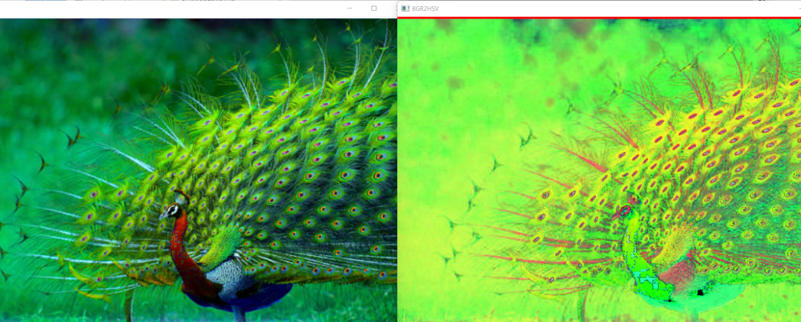

# Color Conversion
## AIM
To perform the color conversion between RGB, BGR, HSV, and YCbCr color models.

## Software Required:
Anaconda - Python 3.7
## Algorithm:
### Step1:
import opencv

### Step2:
Read the original Image.

### Step3:
Store the required conversion of the image in a variable.

### Step4:
Show the image stored in the given variable.

### Step5:
Destroy all the windows and end the program.

## Program:
```
Developed By: M.Sowmya
Register Number: 212221230107
```
## i) Convert  RGB to HSV, GRAY,YCrCb,BGR
  ### RGB to HSV
  ```
  import cv2
  peacock_color_image= cv2.imread('peacock.png')
  cv2.imshow ('Original image', peacock_color_image)
  hsv_image = cv2.cvtColor (peacock_color_image, cv2.COLOR_RGB2HSV)
  cv2.imshow('RGB2HSV', hsv_image)
  cv2.waitKey(0)
  cv2.destroyAllWindows()
  ```
  ### RGB to GRAY
  ```
   import cv2
   peacock_color_image= cv2.imread('peacock.png')
   cv2.imshow ('Original image', peacock_color_image)
   gray_image=cv2.cvtColor(peacock_color_image, cv2.COLOR_RGB2GRAY)
   cv2.imshow('RGB2GRAY', gray_image)
   cv2.waitKey(0)
   cv2.destroyAllWindows()
   ```
   ### RGB to YCrCb
   ```
   import cv2
   peacock_color_image = cv2.imread('peacock.png')
   cv2.imshow('Original Image',peacock_color_image)
   YCrCb_image = cv2.cvtColor(peacock_color_image, cv2.COLOR_RGB2YCrCb)
   cv2.imshow('RGB2YCrCb',YCrCb_image)  
   cv2.waitKey(0)
   cv2.destroyAllWindows()
   ```
   ### RGB to BGR
   ```
   import cv2
   peacock_color_image= cv2.imread('peacock.png')
   cv2.imshow ('Original image', peacock_color_image)
   bgr_image = cv2.cvtColor (peacock_color_image, cv2.COLOR_RGB2BGR)
   cv2.imshow('RGB2BGR', bgr_image)
   cv2.waitKey(0)
   cv2.destroyAllWindows()   
   ```  
## ii)Convert HSV to RGB and BGR
   ### HSV to RGB
   ```
   import cv2
   peacock_hsv_image=cv2.imread('peacock_hsv.png')
   cv2.imshow('HSV_image',peacock_hsv_image)
   RGB_image=cv2.cvtColor(peacock_hsv_image,cv2.COLOR_HSV2RGB)
   cv2.imshow('HSV2RGB',RGB_image)
   cv2.waitKey(0)
   cv2.destroyAllWindows()
   ```
   ### HSV to BGR
   ```
   import cv2
   peacock_hsv_image=cv2.imread('peacock_hsv.png')
   cv2.imshow('HSV_image',peacock_hsv_image)
   BGR_image = cv2.cvtColor(peacock_hsv_image, cv2.COLOR_HSV2BGR)
   cv2.imshow('HSV to BGR',BGR_image)
   cv2.waitKey(0)
   cv2.destroyAllWindows()
   ```
## iii)Convert  BGR to YCrCb, HSV, GRAY:
   ### BGR TO HSV
   ```
   import cv2
   peacock_bgr_image= cv2.imread('Downloads/bgr_image.png')
   cv2.imshow ('bgr_image', peacock_bgr_image)
   hsv_image = cv2.cvtColor (peacock_bgr_image, cv2.COLOR_BGR2HSV)cv2.imshow('BGR2HSV', hsv_image)
   cv2.waitKey(0)
   cv2.destroyAllWindows()
   ```
   ### BGR TO GRAY
   ```
   import cv2
   peacock_bgr_image= cv2.imread('Downloads/bgr_image.png')
   cv2.imshow ('bgr_image', peacock_bgr_image)
   gray_image= cv2.cvtColor (peacock_bgr_image, cv2.COLOR_BGR2GRAY)
   cv2.imshow('BGR2GRAY', gray_image)
   cv2.waitKey(0)
   cv2.destroyAllWindows()
   ```
   ### BGR TO YCrCb
   ```
   import cv2
   peacock_bgr_image = cv2.imread('Downloads/bgr_image.png')
   cv2.imshow('bgr_image', peacock_bgr_image)
   YCrCb_image = cv2.cvtColor(peacock_bgr_image, cv2.COLOR_BGR2YCrCb)
   cv2.imshow('BGR2YCrCb',YCrCb_image)  
   cv2.waitKey(0)
   cv2.destroyAllWindows()
   ```

## iv)Split and Merge RGB Image:
  
  ```
  import cv2
  img = cv2.imread("peacock.png")
  img1= cv2.resize(img, (270,190))
  cv2
  B,G,R = cv2.split(img1)
  cv2.imshow("RED MODEL", R)
  cv2.imshow("GREEN MODEL", G)
  cv2.imshow("BLUE MODEL ", B)
  merger = cv2.merge([B,G,R])
  cv2.imshow("MERGED IMAGE", merger )
  cv2.waitKey(0)
  cv2.destroyAllWindows()
  ```
## v) Split and merge HSV Image
```
import cv2
img = cv2.imread("peacock.png")
img1= cv2.resize(img, (270,190))
HSV = cv2.cvtColor(img1 , cv2.COLOR_BGR2HSV)
cv2.imshow("Initial_HSV ", HSV)
H,S,V = cv2.split(HSV)
cv2.imshow("RED MODEL", H)
cv2.imshow("GREEN MODEL",S)
cv2.imshow("BLUE MODEL ", V)
merger = cv2.merge([H,S,V])
cv2.imshow("MERGED IMAGE", merger )
cv2.waitKey(0)
cv2.destroyAllWindows()
```
## Output:
## i) RGB to HSV, GRAY,YCrCb,BGR:
### RGB to HSV:

### RGB to GRAY:

### RGB to YCrCb:

 ### RGB to BGR:


## ii) HSV to RGB and BGR
### HSV to RGB:

### HSV to BGR:


### iii) BGR to YCrCb, HSV, GRAY:
### BGR TO HSV:

### BGR TO GRAY:

### BGR TO YCrCb:


### iv) Split and merge RGB Image:


### v) Split and merge HSV Image:


## Result:
Thus the color conversion was performed between RGB, HSV and YCbCr color models.
